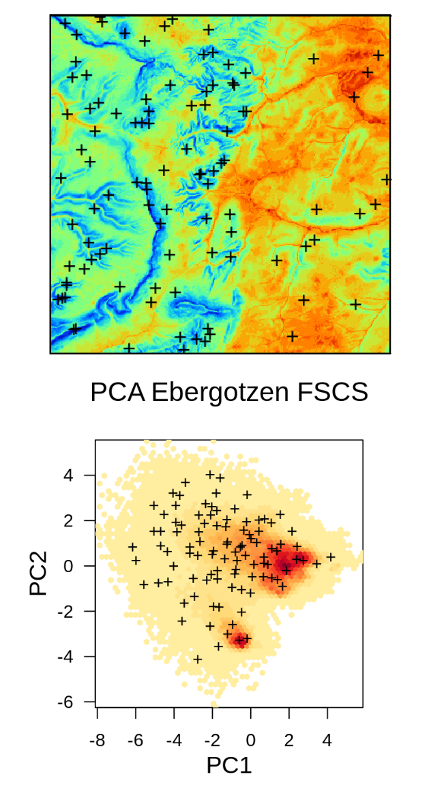

# Introduction {.unnumbered}

## Overview {.unnumbered}

[{.cover width="250"}](https://opengeohub.github.io/spatial-sampling-ml/) This [Rmarkdown tutorial](https://opengeohub.github.io/spatial-sampling-ml/) provides practical instructions, illustrated with sample 
dataset, on how to generate and evaluate sampling plans using your own data. 
The specific focus is put on preparing sampling designs for predictive mapping, 
running analysis and interpretation on existing point data and planning 2nd and 3rd 
round sampling (based on initial models).

We use several key R packages and existing tutorials including:

- [sp](https://github.com/edzer/sp) package,
- [clhs](https://github.com/pierreroudier/clhs) package,
- [mlr](https://mlr.mlr-org.com/) package,
- [ranger](https://github.com/imbs-hl/ranger/) package,
- [forestError](https://github.com/benjilu/forestError) package,

For an introduction to Spatial Data Science and Machine Learning with R we recommend studying first:

- Becker, M. et al.: **[“mlr3 book”](https://mlr3book.mlr-org.com/)**;  
- Irizarry, R.A.: **[“Introduction to Data Science: Data Analysis and Prediction Algorithms with R”](https://rafalab.github.io/dsbook/)**;  
- Molnar, C.: **[“Interpretable Machine Learning: A Guide for Making Black Box Models Explainable”](https://christophm.github.io/interpretable-ml-book/)**;  
- Lovelace, R., Nowosad, J. and Muenchow, J.: **[“Geocomputation with R”](https://geocompr.robinlovelace.net/)**;  
- Pebesma, E. and Bivand, R: **[“Spatial Data Science: with applications in R”](https://keen-swartz-3146c4.netlify.app/)**;  

If you are looking for a more gentle introduction to spatial sampling methods in R 
please refer to @Bivand2013Springer, @BRUS2019464 and @Brus2021sampling. 
The _“Spatial sampling with R”_ book by Dick Brus and R code examples are 
available via <https://github.com/DickBrus/SpatialSamplingwithR>.

Machine Learning in **python** with resampling can be best implemented via the [scikit-learn library](https://scikit-learn.org/stable/), 
which matches in functionality what is available via the mlr package in R.

To install the most recent **landmap**, **ranger**, **forestError** and **clhs** packages from Github use:


```r
library(devtools)
devtools::install_github("envirometrix/landmap")
devtools::install_github("imbs-hl/ranger")
devtools::install_github("benjilu/forestError")
devtools::install_github("pierreroudier/clhs")
```

## License {.unnumbered}

[](http://creativecommons.org/licenses/by-sa/4.0/)

This work is licensed under a [Creative Commons Attribution-ShareAlike 4.0 International License](http://creativecommons.org/licenses/by-sa/4.0/).


## Acknowledgements {.unnumbered}

This manual is based on the **[“R for Data Science”](https://r4ds.had.co.nz/)** book by Hadley Wickham and contributors.

[OpenLandMap](https://openlandmap.org) is a collaborative effort and many people 
have contributed data, software, fixes and improvements via pull request. [OpenGeoHub](https://opengeohub.org) 
is an independent not-for-profit research foundation promoting Open Source and Open Data solutions.

[](https://opengeohub.org)
